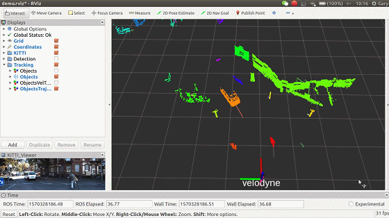
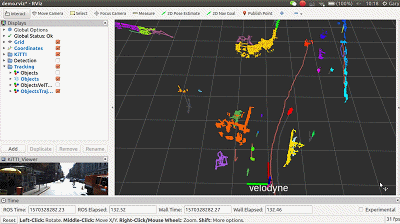

# tracking_lib
　　The LiDAR tracking library, for tracking objects obtaining from segmentation-based detection and improve segmentation.
<p align="center">
    
    
</p>
## How to use
1. We name your ros workspace as `CATKIN_WS` and `git clone` as a ROS package.
    ```bash
    
    # we recommand you to organize your workspace as following
    $ mkdir -p ~/tracking_ws/src
    
    # git clone basic common libraries
    $ cd ~/tracking_ws/src
    $ git clone https://github.com/zhz03/lidar_tracking.git
    # checkout ubuntu20 branch
    $ git checkout ubuntu20
    
    # build your ros workspace for our Tracking-help segmentation demo
    $ cd ~/tracking_ws
    $ catkin_make
    ```
    
2. Run demo with kitti rosbag:
    + **Terminal 1**: convert kitti into rosbag.  Put your kitti2bag.py under your kitti dataset folder, like this:
    
        ```
        .
        ├── 2011_09_26
        │   ├── 2011_09_26_drive_0017_sync
        │   │   ├── image_00
        │   │   ├── image_01
        │   │   ├── image_02
        │   │   ├── image_03
        │   │   ├── oxts
        │   │   └── velodyne_points
        │   ├── calib_cam_to_cam.txt
        │   ├── calib_imu_to_velo.txt
        │   └── calib_velo_to_cam.txt
        └── kitti2bag.py
        
        ```
    
        In the terminal: 
    
        ```
        # activate conda environment
        conda activate Your_environment
        python kitti2bag.py -t 2011_09_26 -r 0002 raw_synced .
        ```
    
        After you finish running the code, you will get:
    
        ```
        ├── kitti_2011_09_26_drive_0017_synced.bag
        ```
    
    + Play converted rosbag and modify the `detection.yaml` and `tracking.yaml` accordingly.
      
    + **Terminal 2**: launch **Tracking-help Segmentation** demo.
      
        ```bash
        $ cd ~/tracking_ws
        $ source devel/setup.bash
        $ roslaunch tracking_lib demo.launch
        ```

## [Parameters](./launch/demo.launch)
　*detection.yaml* and *tracking.yaml* configure the detection_node and tracking_node in sample. *kitti/\*.yaml* configure the algorithm parameters for KiTTI Dataset, *Segmenter.yaml* and *TrackingWorker.yaml* separately for **Seg-based Segmentation**, **Tracking**.
```bash
./config
├── detection.yaml
├── kitti
│   ├── Segmenter.yaml
│   └── TrackingWorker.yaml
└── tracking.yaml
```

## TODO lists
<p align="center">
    
</p>
